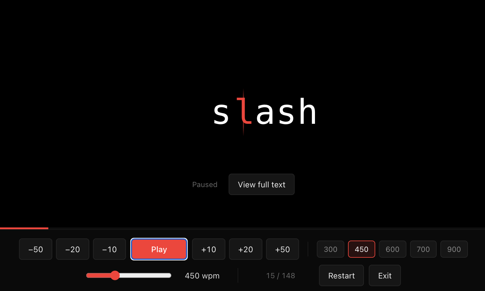

# speedread

> Read long Claude responses, plans, and specs at 300–900 words per minute without scrolling.

A Claude Code plugin that ships a browser-based **RSVP (Rapid Serial Visual Presentation)** reader. Flashes text one word at a time with the focal letter aligned to a red guide line so your eyes don't have to move. Strips code blocks, tables, and other things that don't speed-read well, and inserts pause beats around lists and headers so your brain has time to switch context.



## Install

```
/plugin marketplace add mathissprlch/speedread
/plugin install speedread@speedread-marketplace
```

Then in any Claude Code session:

```
/speedread
```

## Usage

| Invocation | What it reads |
|---|---|
| `/speedread` | The most recent substantial Claude response |
| `/speedread the plan` | A referenced prior message |
| `/speedread @path/to/file.md` | A file from disk |
| `/speedread <text…>` | Verbatim input |

Add speed hints inline: `/speedread fast`, `/speedread at 700 wpm`, `/speedread slow`.

### Controls in the reader

| Key | Action |
|---|---|
| `Space` | Pause / resume |
| `←` / `→` | Jump 10 words |
| `Shift+←/→` | Jump 20 |
| `⌘/Ctrl+←/→` | Jump 50 |
| `↑` / `↓` | Speed ±25 wpm |
| `Esc` | Open full-text view (pick any word to resume from, Esc closes + resumes) |

## How it works

1. Claude pre-filters the source text (drops fenced code blocks, large tables, ASCII diagrams).
2. The skill writes the filtered text to a temp file and runs `launch.sh`.
3. `launch.sh` uses `node` to inject the text into a self-contained HTML and opens it with `open` (macOS) or `xdg-open` (Linux).
4. The reader tokenizes the text, computes the optimal recognition point (ORP) for each word, and flashes them at the chosen WPM with adaptive dwell time for long words and sentence-ending punctuation.

The reader is a single standalone HTML file — no build step, no dependencies. You can also open `index.html` directly in any browser and paste text in, no Claude Code required.

## Requirements

- **Claude Code** ≥ the version that supports plugin marketplaces (any 2026 build)
- `node` on `PATH` (used by the launcher to JSON-encode and inject text into the HTML template)
- A default browser (macOS `open` or Linux `xdg-open`)

Tested on macOS. Linux should work; Windows users can use the standalone web app (open `index.html` directly).

## Where it works

| Surface | Works? |
|---|---|
| Claude Code (terminal) | ✓ |
| Claude Code in VS Code / JetBrains / Zed | ✓ (shares `~/.claude/`) |
| Claude Desktop — Code tab, local session | ✓ |
| Claude Desktop — Code tab, cloud session | ✗ (sandboxed VM, no browser) |
| claude.ai web | ✗ (no skills support; use `index.html` standalone instead) |

## Repository layout

```
speedread/
├── .claude-plugin/
│   └── marketplace.json          # marketplace catalog
├── plugins/
│   └── speedread/
│       ├── .claude-plugin/
│       │   └── plugin.json       # plugin manifest
│       ├── skills/
│       │   └── speedread/
│       │       ├── SKILL.md      # skill definition Claude reads
│       │       ├── launch.sh     # builds & opens the embedded HTML
│       │       └── reader.html   # the RSVP reader UI (single-file app)
│       └── README.md
├── index.html → plugins/.../reader.html   # symlink for direct/standalone use
├── INSTALL.md                    # detailed install (4 paths)
├── README.md                     # this file
└── LICENSE                       # MIT
```

## Development

```bash
git clone https://github.com/mathissprlch/speedread
cd speedread

# Install as plugin from local path (for iteration)
# In Claude Code:
#   /plugin marketplace add /absolute/path/to/speedread
#   /plugin install speedread@speedread-marketplace

# Validate manifests
claude plugin validate .
```

Edit `plugins/speedread/skills/speedread/reader.html` to iterate on the reader. Edit `SKILL.md` to change Claude's pre-processing rules.

See [INSTALL.md](INSTALL.md) for all four installation paths.

## License

[MIT](LICENSE) © Mathis Sperlich
